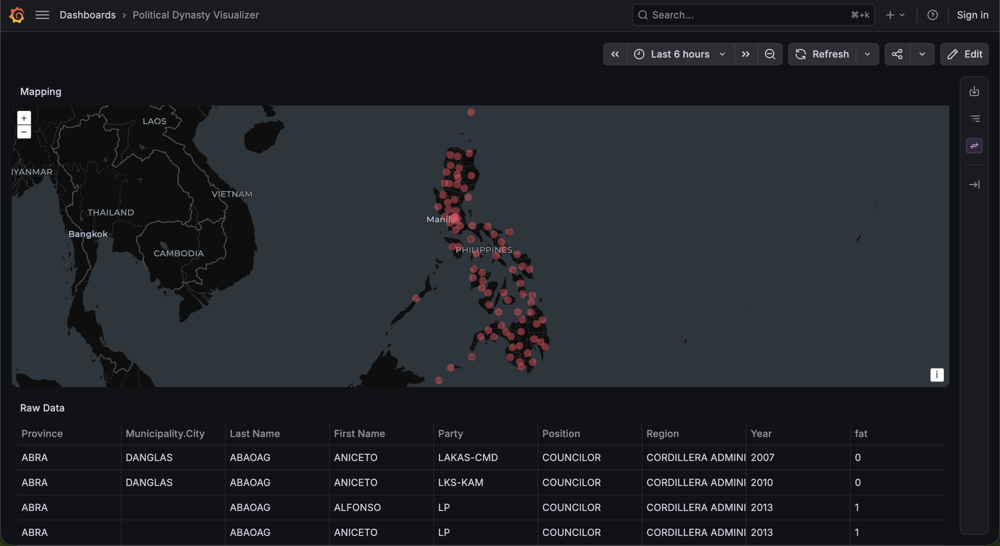

# Grafana Political Dynasty Visualizer

A Grafana dashboard that visualizes Philippine political dynasty data on an interactive map, using the [Infinity datasource](https://grafana.com/grafana/plugins/yesoreyeram-infinity-datasource/) plugin to load a CSV dataset.

## Features

- **Mapping panel** – geographic visualization of political dynasty data
- **Raw Data panel** – browsable table of the dataset
- **Self-provisioned** – datasource and dashboard are configured automatically on startup



## Getting Started

Requires [Docker](https://www.docker.com/).

```bash
docker compose up -d
```

Grafana will be available at http://localhost:3000 with anonymous access enabled.

The datasource is provisioned to pull the dataset from:

```
https://raw.githubusercontent.com/veenoise/grafana-political-dynasty-visualizer/main/dataset.csv
```

## Repository Layout

| Path | Description |
| --- | --- |
| `compose.yaml` | Docker Compose configuration for Grafana |
| `grafana-datasources.yaml` | Provisions the Infinity datasource |
| `grafana-dashboards.yaml` | Provisions dashboards from `dashboards/` |
| `dashboards/` | Dashboard JSON definitions |
| `dataset.csv` | Political dynasty dataset |

## Acknowledgements

This project uses the **Ateneo Policy Center (APC) Political Dynasties Dataset**, available at https://data.bettergov.ph/datasets/3, published by [bettergov.ph](https://www.bettergov.ph/).